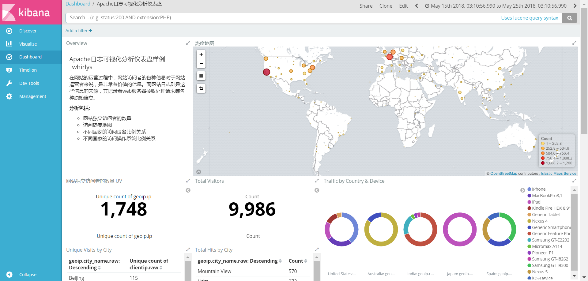
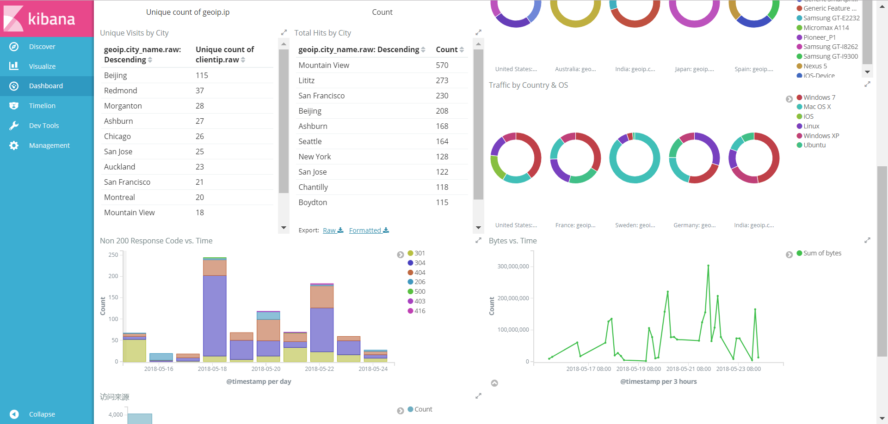

## Apache日志可视化分析

在网站的运营过程中，网站访问者的各种信息对于网站运营者来说，是非常有价值的信息。而网站日志则是这些信息的来源，其记录着web服务器接收处理请求等各种原始信息。


#### 分析包括

- 网站独立访问者的数量
- 访问热度地图
- 不同国家的访问设备比例关系
- 不同国家的访问操作系统比例关系

#### 结果






#### 环境说明

* Elasticsearch 版本 5.5.1
* Logstash 版本 5.5.1
* Kibana 版本 5.5.1
* JDK 版本 1.8


#### 步骤

**1、 导入数据**

首先需要修改 `config/apache_logstash.conf` 的第3行，path 指向 `logs/apache_logs` 

然后修改第37行， `hosts` 指向 Elasticsearch 的地址

最后修改第39行，`template` 指向 `config/apache_template.json`


下载 logstash 5.5.1，下载完成之后执行

```
logstash-5.5.1/bin/logstash -f /root/apache_log_demo/config/apache_logstash.conf
```


**2、搜索分析**

在可视化界面 “Management”=> “Index Patterns” 页签，输入“apache_elastic_example”作为index name，选择@timestamp 作为刷新字段，点击 create 按钮创建 index patten


在可视化界面 “Management – Saved Objects” 页签，点击 import 按钮，选择 config/apache_kibana.json 文件，并点击“Yes, overwrite all” 导入

在可视化界面 “Dashboard” 中点击 “Apache日志可视化分析仪表盘” 即可开始日志分析


> 注：实验来自于华为云学院